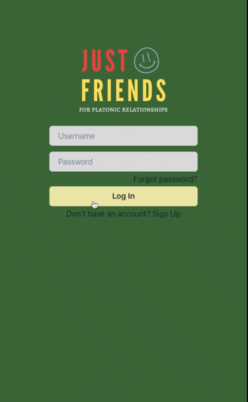
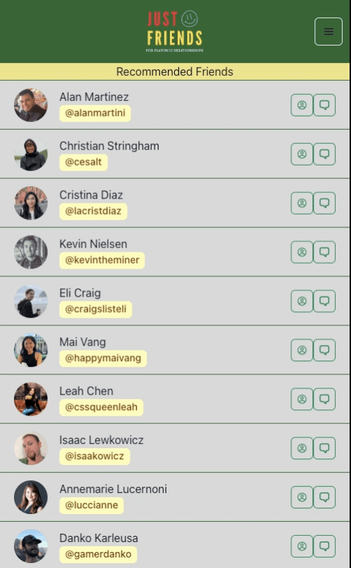

# Just Friends

A React/Rails web application for live messaging in real time.
 
 
To watch the <a href="https://www.loom.com/share/6e4d20ad5c4f474da4dc8f24e27e2083"> Demo </a>  
To visit the <a href="https://justfriendsapp.herokuapp.com/"> Live Website </a>  

## Overview

- Utilizes Rails Action Cable to integrate WebSockets for real-time messaging
- Users are able to view other user's profile and have full CRUD capabilities on their own account
- Start conversations and create messages with emoji integration 

## GIFs

&nbsp;&nbsp;&nbsp;&nbsp;&nbsp;&nbsp;&nbsp;&nbsp;&nbsp;  &nbsp;&nbsp;&nbsp;&nbsp;&nbsp;&nbsp;&nbsp;&nbsp;&nbsp;| 
:-------------------------:|:-------------------------:
Login and Signup  |  View other profiles and interact with personal profile

|  |
:-------------------------:
| User to user real time messaging |
  

